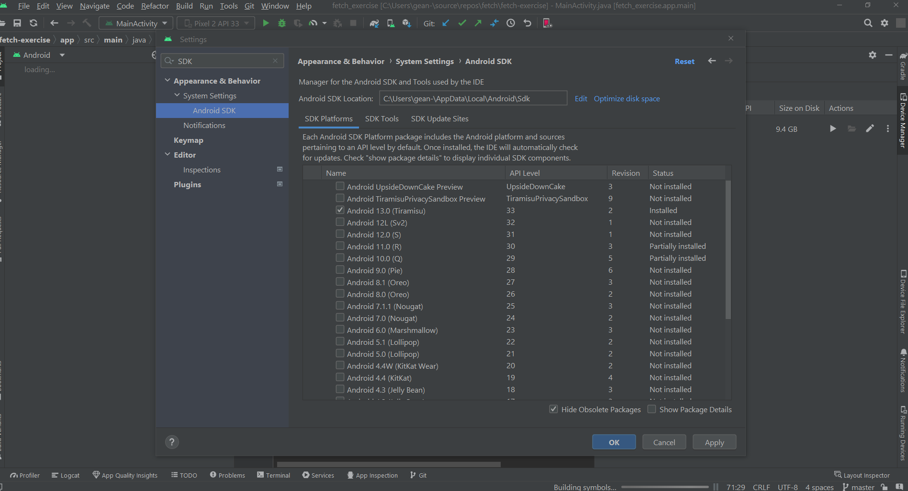
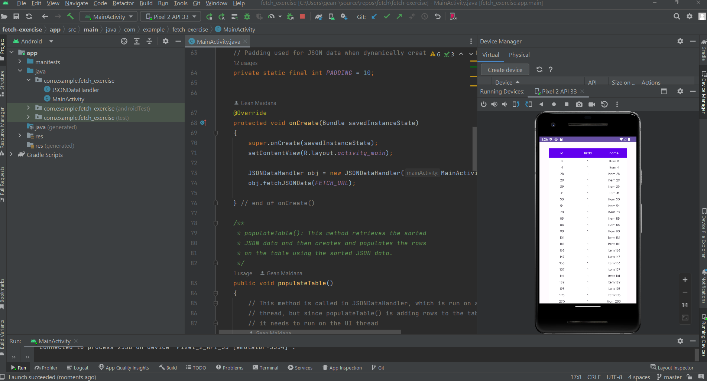

# Build instructions

Right click on [MainActivity class](https://github.com/gcmaidana/fetch-exercise/blob/master/app/src/main/java/com/example/fetch_exercise/MainActivity.java) and run the program in Android Studio.
You can run it on your own physical device if you'd like, but
if you want to use a emulator, I recommend the Pixel 2 in Android Studio
because it has a fairly large screen.

For Android Studio, I used Android Studio Flamingo | 2022.2.1
- JDK 17.
- SDK 33.

# Notes

I tried making the code as modular as possible, which is why one class deals mostly with UI ([MainActivity](https://github.com/gcmaidana/fetch-exercise/blob/master/app/src/main/java/com/example/fetch_exercise/MainActivity.java)) and the other class deals with the JSON data ([JSONDataHandler](https://github.com/gcmaidana/fetch-exercise/blob/master/app/src/main/java/com/example/fetch_exercise/JSONDataHandler.java)). I could have put all of my code into the MainActivity class but I want the code to be modular, easy to read, and to adhere to the Single Responsibility Principle. 

The program is multithreaded since Android doesn't allow you to do network operation on the UI thread. I have two functions in the JSON class that are important: one that fetches the data, and one that sorts the data. These two methods and their respective threads are done sequentially in order to not have any data inconsistencies/errors. The method that fetches the JSON data opens a thread and handles that, then at the end of that method, the sort method is called. The sort method takes in an jsonArray parameter (the fetched JSON data) and also opens a thread. I did it this way because if I call both threads in MainActivity, then they can run concurrently and that can cause problems with data inconsistency. Also, I could have done the fetching and sorting all in one function in one thread rather than two, but like I said, I am trying to have my code be as modular as possible, so that's just a trade-off I made.

In terms of how the data is displayed on screen, I just used a table. You can see what it looks like in the screenshot at the bottom of this README file. You obviously can't tell from a screenshot alone, but you can scroll down the table to view the other files. Here's a [hyperlink to the relevant XML file](https://github.com/gcmaidana/fetch-exercise/blob/master/app/src/main/res/layout/activity_main.xml)

# Testing Notes
I had trouble developing unit tests for my methods because of how the program is multithreaded and having to mock the behavior in order to unit test. I did try to mock the behavior using Mockito and I also tried with Robolectric but I didn't have any success.

In terms of manual testing, I did do emulation tests on the following devices that target the current OS release (Android 13) without a problem:

- Pixel 2 API 33 (Emulation) - 1080 x 1920 pixels
- Nexus S API 33 (Emulation) - 480 x 800 pixels
- Samsung Galaxy S10 (Physical device) - 2280 x 1080 pixels (FHD+)

Additionally, I also verified output by pasting and then filtering the JSON data into Google Sheets and comparing that to my output in the App and it was identical.

